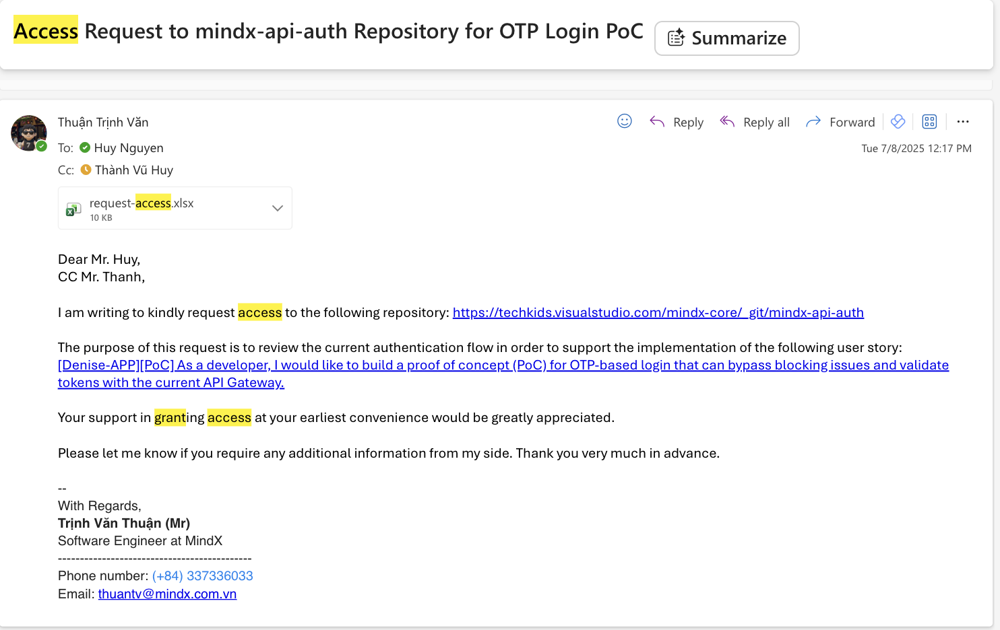

# Câu hỏi thường gặp

## Giờ giấc & Chế độ

**Giờ làm việc:** 09:00 - 18:30.\
Tech Team có linh động về thời gian làm việc, tuy nhiên cần phối hợp tốt với khung thời gian của team để đảm bảo
tiến độ công việc.

**Hybrid/Remote:** Không áp dụng hybrid cố định. Nếu có việc cần remote,
có thể chủ động trao đổi và sắp xếp với team.

**Nghỉ phép:** 1 tháng được 1 ngày phép. Tối đa 15 ngày phép/năm.

## Quá trình Test & Onboarding

**Tham gia dự án thật hay chỉ làm bài test?**\
Dự án trong quá trình test chia làm 2 giai đoạn 2 tuần (tổng 4 tuần), giai đoạn đầu để phân loại ứng viên và tự học một số core techstack của team, giai đoạn sau sẽ tham gia và đem lại giá trị thật giá trị cho tổ chức.

**Tiêu chí đánh giá:**\
Bài test được thiết kế theo 4 tuần, đánh giá theo từng tuần. Mỗi bài
test có tiêu chí chấm riêng. Ngoài ra còn đánh giá khả năng phối hợp,
giải quyết vấn đề và khả năng follow theo hướng dẫn của mentor.

## Phúc lợi & Trợ cấp

**Trợ cấp trong thời gian test:** Không có trong 4 tuần test. Nếu pass
sẽ ký hợp đồng và nhận offer.

**Rank lương sau khi pass:** Tối đa 15 triệu/tháng. Công ty mở cho ứng
viên tự đưa ra offer dựa trên năng lực và performance.

## Văn hoá & Môi trường

**Hoạt động nội bộ:**\
Có teambuilding, đào tạo nội bộ, khoá học bổ sung kiến thức.\
Trong team có mini game như đá PES, thể thao,...

**Teamwork & Kỹ thuật:**\
Có pair coding và code review thường xuyên. Team có nhiều hoạt động thể
thao.

## Kỹ thuật & Dự án

**Tech stack chính:** Typescript, K8S, Azure, Docker, Kafka, Mongo,
MERN.

**Quy trình làm việc:** Theo Agile/Scrum với chu kỳ Sprint 2 tuần.

**Sản phẩm:** Làm hoàn toàn product, không outsource.

## Quy định chung

**Dress code:**\
Ngày đầu và các sự kiện: nên ăn mặc lịch sự.\
Ngày thường: thoải mái, quần đùi áo phông đều được.

**Overtime (OT):**\
Không khuyến khích OT. Không tính lương OT.\
Nếu OT có thể nghỉ bù vào hôm sau khi cần.

**Bảo mật:**\
Tuân thủ bảo mật dữ liệu công ty khi làm việc từ bất kỳ đâu.

## Lưu ý trong quá trình làm việc

**Giao tiếp qua mail:**\
Cần tuân thủ sự chuyên nghiệp, lịch sự
[Tham khảo cách viết mail chuyên nghiệp](https://www.google.com/search?q=mail+chuy%C3%AAn+nghi%E1%BB%87p&oq=mail+chuy%C3%AAn+nghi%E1%BB%87p&gs_lcrp=EgZjaHJvbWUyBggAEEUYOTILCAEQABgKGAsYgAQyCwgCEAAYChgLGIAEMgsIAxAAGAoYCxiABDIKCAQQABgKGBYYHjIICAUQABgWGB4yCggGEAAYChgWGB4yCggHEAAYgAQYogTSAQg0NjUwajBqN6gCALACAA&sourceid=chrome&ie=UTF-8)

**Kênh giao tiếp chính thức trong quá trình làm việc:**\
Microsoft Teams, Outlook

**Cách xin tài khoản, phân quyền**
Viết email lịch sự tới người có thẩm quyền (Thường sẽ là anh HuyNQ (huynq@mindx.com.vn)) và cc tới những người liên quan (mentor trực tiếp, ...)

Nội dung mail cần thể hiện rõ mục đích, lý do, thời hạn xin phân quyền. Ví dụ:

**File mẫu xin phân quyền:**\
[File mẫu request-access.xlsx](./request-access.xlsx) (đính kèm trong mail khi gửi yêu cầu)

**Trong quá trình 2 tuần này, có được trao đổi với mentor không ?**\
Có, nên trao đổi thường xuyên, có thể hằng ngày để gỡ vướng mắc, khó khăn, nhờ hỗ trợ và tư vấn kịp thời.\
Khung giờ trao đổi phù hợp là trong giờ làm việc (8:30 - 18:30), trừ trường hợp bất khả kháng, rủi ro cao như bảo mật, lộ key, ...
